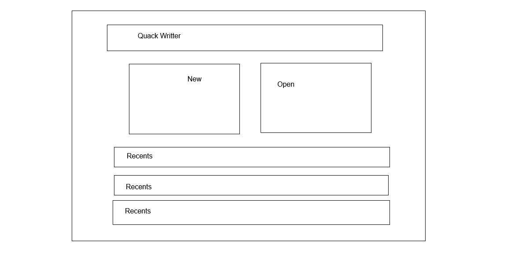
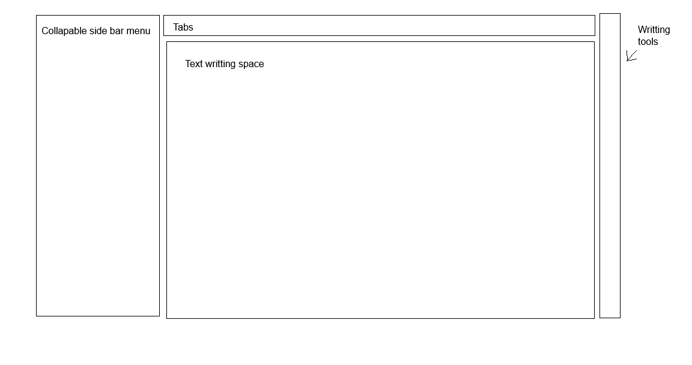

# Quack Writer 🦆

[](https://github.com/Flametossed/Quack-Writer/actions/workflows/ci.yml)

A sleek, modern, **native Windows writing app** — a faster, more capable
alternative to Notepad. Built with **Tauri 2, React 18, TypeScript, Zustand,
and CodeMirror 6**.




## Highlights

**Writing**

- Markdown with **live preview** (rendered by default for `.md`; `Ctrl+E`
  toggles source view with line numbers) and plain-text editing
- Formatting sidebar: headings, bold/italic/strike, inline code, links,
  quotes, lists, fenced code blocks
- **Spellcheck** with red squiggles plus a right-click menu offering
  suggestions and *Add to dictionary*, powered by the Windows Spell Checking
  API — the same engine Edge uses
- Readability-first editor: centered ~70-character column, comfortable line
  height, softened dark & light palettes tuned for long sessions

**Files**

- Open a **workspace folder**: lazy-loaded file tree, drag-and-drop between
  folders, inline rename, subfolder creation, expand/collapse all
- Tabs + an Open Documents panel with filtering, reordering, and dirty
  indicators
- **Auto-save** (debounced) with **atomic writes** (temp file + rename — a
  crash can't corrupt your document)
- **Unsaved-work protection**: dirty documents are flushed on tab switch,
  window blur, and app close; never-saved scratch docs prompt first
- Recent documents on the Start Menu

**Interface**

- Application menu bar (File / View) with a Home button back to the Start Menu
- Toggleable sidebars, persisted across launches
- Integrated **Find** field in the status bar with match count and wrap-around
- Selection-aware word/character counts and estimated reading time
- Text zoom like Notepad: `Ctrl+=` / `Ctrl+−` / `Ctrl+0` and `Ctrl+scroll`
- Dark / light theme and editor font family/size, all persisted

> Files are read as UTF-8. Legacy ANSI files are decoded best-effort
> (unmappable bytes become `�`) and saved back as UTF-8.

## Keyboard shortcuts

| Shortcut | Action |
| --- | --- |
| `Ctrl+N` | New document |
| `Ctrl+O` / `Ctrl+Shift+O` | Open file / open folder |
| `Ctrl+S` | Save |
| `Ctrl+E` | Toggle Markdown preview ⇄ source |
| `Ctrl+F` | Find in document (`Enter` next, `Shift+Enter` previous, `Esc` clear) |
| `Ctrl+B` / `Ctrl+Alt+B` | Toggle Explorer / Format sidebar |
| `Ctrl+=` / `Ctrl+−` / `Ctrl+0` | Text zoom in / out / reset (also `Ctrl+scroll`) |
| `Alt+F` / `Alt+V` | File / View menu |

## Installation

### Prerequisites

- **Node.js ≥ 20** and npm
- **Rust** (stable) via [rustup](https://rustup.rs)
- Tauri platform prerequisites
  ([guide](https://tauri.app/start/prerequisites/)) — on Windows: Visual
  Studio C++ Build Tools ("Desktop development with C++" workload) and the
  WebView2 runtime (preinstalled on Windows 10/11)

### Build from source

```sh
npm install
npm run tauri dev     # run the native app
npm run tauri build   # build installers → src-tauri/target/release/bundle/
```

## Development

| Script | Description |
| --- | --- |
| `npm run tauri dev` | Native app with frontend hot reload |
| `npm run dev` | Frontend-only web mode (browser File System Access fallback) |
| `npm run typecheck` | TypeScript validation |
| `npm run lint` | ESLint |
| `npm run build` | Production frontend build |
| `cargo test --manifest-path src-tauri/Cargo.toml` | Native filesystem tests |

The app targets Windows first; `npm run dev` runs a browser fallback useful
for quick UI work, but native features (workspace tree, spellcheck
suggestions, atomic saves) need the Tauri shell.

### Project structure

```
src/                        # React frontend
├── App.tsx                 # Shell: Start Menu vs Editor
├── components/             # StartMenu, FileExplorer, Tabs, MarkdownEditor,
│                           # MarkdownPreview, FormatBar, StatusBar,
│                           # AppMenuBar, EditorContextMenu, …
├── lib/
│   ├── docActions.ts       # All open/save/close/rename flows
│   ├── fileIo.ts           # Dual-mode IO (Tauri ⇄ browser fallback)
│   ├── spell.ts            # Native spelling suggestions
│   └── useCloseGuard.ts    # App-level unsaved-work protection
├── store/                  # Zustand: docs, workspace, ui, save, theme, font
└── styles/global.css       # Theme tokens

src-tauri/                  # Rust backend
├── src/fs_io.rs            # Filesystem commands (atomic writes)
├── src/spell.rs            # Windows Spell Checking API (ISpellChecker)
└── capabilities/           # Minimal permission set
```

## Notes

- App icons in `src-tauri/icons/` are generated placeholders (the duck
  glyph). Regenerate a full set with `npm run tauri icon path/to/icon.png`
  before a public release.
- Spelling suggestions use your Windows display language and fall back to
  en-US; words added to the dictionary go to the Windows custom dictionary
  shared with Edge.
